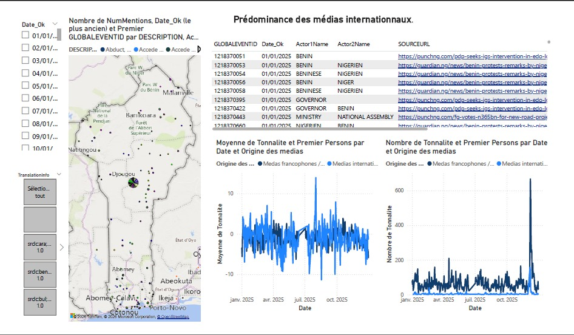
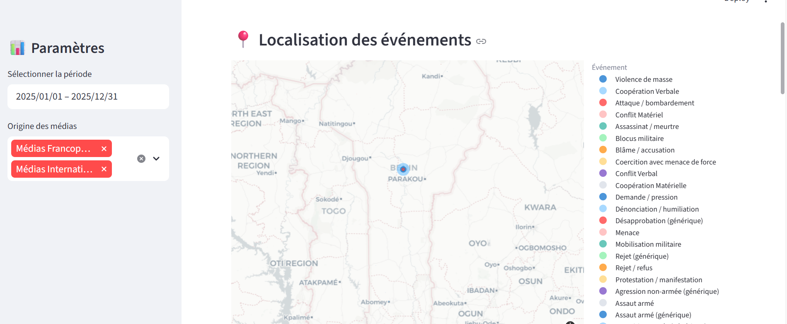
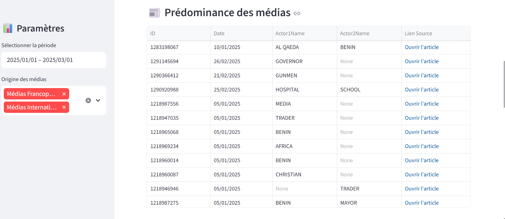
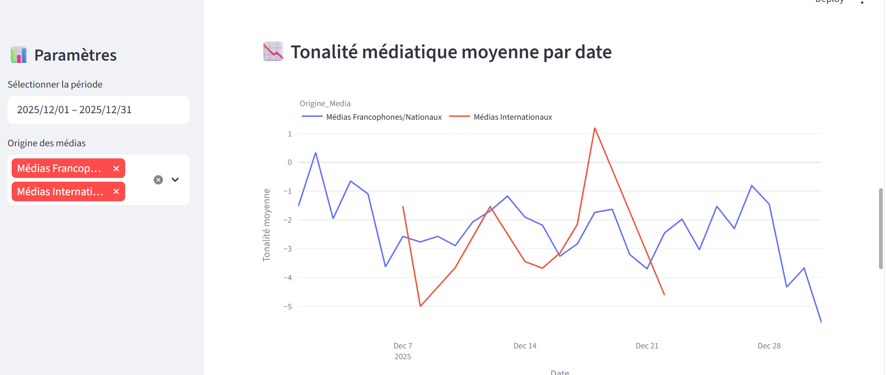
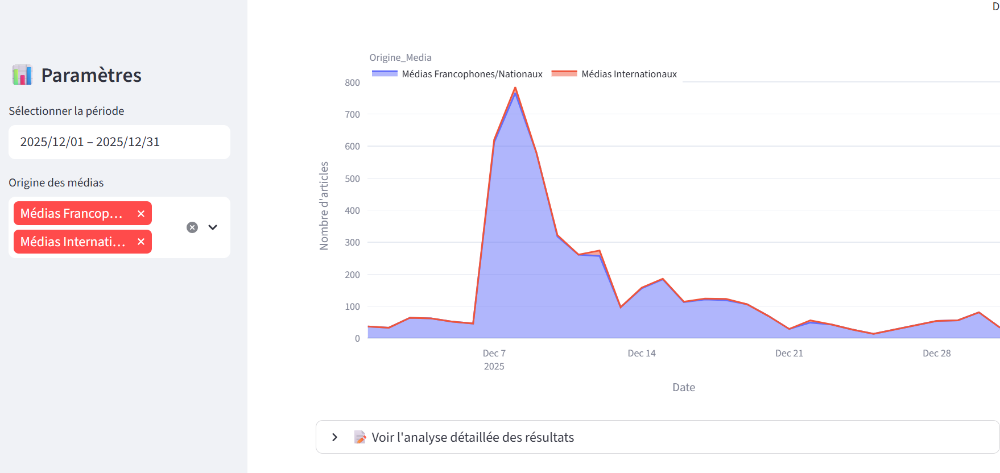

# 🇧🇯 Bénin Insights Challenge — iSHEERO × DataCamp Donates 2026

> **Transformer des données mondiales en connaissance locale.**

---

## Table des matières

1. [Présentation du projet](#1-présentation-du-projet)
2. [Équipe](#2-équipe)
3. [Structure du projet](#3-structure-du-projet)
4. [Installation](#4-installation)
5. [Sources de données](#5-sources-de-données)
6. [Extraction des données](#6-extraction-des-données)
7. [Nettoyage et exploration des données](#7-nettoyage-et-exploration-des-données)
8. [Analyse approfondie par le ML](#8-analyse-approfondie-par-le-ml)
9. [Dashboard](#9-dashboard)
10. [Insights clés](#10-insights-clés)
11. [Usage de l'IA](#11-usage-de-lia)

---

## 1. Présentation du projet

Ce projet est réalisé dans le cadre du **Hackathon iSHEERO × DataCamp Donates 2026 — Bénin Insights Challenge**.

**Mission :** Extraire et analyser les événements concernant le Bénin depuis la base de données mondiale **GDELT** sur les 12 derniers mois (Jan 2025 – Décembre 2025), puis produire des insights actionnables à destination de journalistes, chercheurs et décideurs publics.

**Source de données :** [GDELT](https://www.gdeltproject.org/) (Global Database of Events, Language and Tone) — une base publique qui surveille en temps réel les médias du monde entier dans plus de 100 langues, disponible sur Google BigQuery.

**Période analysée :** `20250101` → `20251231`  
**Filtre géographique :** `ActionGeo_CountryCode = 'BN'` (Bénin, code FIPS)

---

## 2. Équipe

| Profil | Nom | Responsabilité |
|--------|-----|----------------|
| Data Engineer | Martin-Junior ADECHI | Pipeline GDELT, extraction BigQuery, nettoyage des données |
| Data Analyst | Denakpo Paule | Dashboard interactif, visualisations, executive summary |
| ML Engineer | BONI Zoul | Analyse de sentiment, clustering, classification des événements |
| Data Scientist | TADOGBE Ahouéfa Trésor Steffi | Approche analytique, interprétation, rapport final, pitch |

---

## 3. Structure du projet

```
.
├── data/
│   ├── raw/                                          # Données brutes extraites de BigQuery
│   └── processed/                                    # Données nettoyées
│
├── notebooks/
│   ├── data_extraction.ipynb                         # Extraction BigQuery
│   ├── data_cleaning.ipynb                           # Nettoyage des données brutes
│   ├── data_exploration.ipynb                        # Analyse exploratoire (EDA)
│   ├── ml_classification.ipynb                       # Modèle de classification
│   ├── ml_clustering.ipynb                           # Modèle de clustering
│   ├── ml_sentiment.ipynb                            # Analyse de sentiment
│   └── visualisations_insights_gdeltevents.ipynb     # Visualisations statistiques
│
├── scripts/
│   └── data_pipeline.py                              # Module Python réutilisable (BigQuery)
│
├── models/
│   ├── classification/                               # Modèle de classification des événements
│   ├── clustering/                                   # Modèle de clustering des événements
│   └── sentiment_analysis/                           # Modèles d'analyse du ton/sentiment
│
├── dashboard/                                        # Power BI
├── requirements.txt
└── README.md
```

> Les données sont régénérables via le notebook d'extraction (voir section [6. Extraction des données](#6-extraction-des-données)).

---

## 4. Installation

### 4.1 Prérequis

- Python 3.11+
- Un compte Google (pour l'accès BigQuery)

### 4.2 Cloner le repo et installer les dépendances

```bash
git clone https://github.com/[organisation]/[repo]
cd [repo]

# Créer un environnement virtuel
python -m venv venv
source venv/bin/activate        # Linux / macOS
venv\Scripts\activate           # Windows

# Installer les dépendances
pip install -r requirements.txt
```

---

## 5. Sources de données

Le projet exploite deux tables complémentaires de GDELT qui répondent à des questions différentes.

**GDELT Events** répond à la question *"Qui a fait quoi à qui, où et quand ?"*. Chaque ligne est un événement géopolitique — une action concrète entre deux acteurs. C'est une base quantitative et structurée utilisée pour compter et classer les événements, cartographier leur répartition géographique, identifier les acteurs impliqués et mesurer les pics de couverture médiatique.

**GDELT GKG** répond à la question *"Comment les médias parlent-ils du Bénin ?"*. Chaque ligne est un article de presse analysé — thèmes détectés, entités nommées, ton éditorial. C'est une base qualitative et sémantique utilisée pour analyser l'évolution du sentiment médiatique dans le temps et identifier les médias les plus actifs.

> Un événement peut avoir un **GoldsteinScale positif** (coopération) dans Events mais un **tone négatif** dans GKG si les médias le couvrent dans un contexte critique. C'est cette tension entre les faits et leur perception médiatique qui produit les insights les plus intéressants.

---

## 6. Extraction des données

Le pipeline d'extraction est composé de deux fichiers qui communiquent :

- **`scripts/data_pipeline.py`** — module Python avec les fonctions BigQuery réutilisables
- **`notebooks/data_extraction.ipynb`** — notebook qui pilote l'extraction et sauvegarde le CSV dans `data/raw/`

Pour générer les données via ce pipeline, une authentification auprès de Google BigQuery est nécessaire. Deux options sont disponibles.

### 6.1 Option A — Service Account JSON *(recommandée pour ce projet)*

Cette option utilise une clé d'accès liée à un projet Google Cloud spécifique.

**Étape 1 — Créer un projet Google Cloud**

Aller sur [console.cloud.google.com](https://console.cloud.google.com), cliquer sur **"Nouveau projet"** et lui donner un nom.

**Étape 2 — Activer l'API BigQuery**

Dans le projet : **"API et services"** → **"Bibliothèque"** → rechercher **"BigQuery API"** → **Activer**.

**Étape 3 — Créer un Service Account**

**"API et services"** → **"Identifiants"** → **"Créer des identifiants"** → **"Compte de service"**.  
Attribuer le rôle **BigQuery User** au compte de service créé.

**Étape 4 — Télécharger la clé JSON**

Cliquer sur le service account → onglet **"Clés"** → **"Ajouter une clé"** → **"JSON"**.  
Le fichier se télécharge automatiquement.

**Étape 5 — Placer le fichier dans le repo**

```bash
# Créer le dossier credentials s'il n'existe pas
mkdir credentials

# Déplacer le fichier téléchargé
mv ~/Downloads/votre-fichier.json credentials/credentials.json
```

> ⚠️ Ne jamais committer ce fichier sur GitHub. Il est déjà listé dans le `.gitignore`.

**Étape 6 — Lancer l'extraction**

Ouvrir `notebooks/data_extraction.ipynb` **depuis la racine du repo** (dans VS Code ou avec `jupyter notebook`), puis exécuter toutes les cellules dans l'ordre.

```
Résultat : data/raw/gdelt_bn_2025.csv est généré automatiquement.
```

### 6.2 Option B — Application Default Credentials (ADC) *(la plus rapide)*

Cette option ne nécessite aucun fichier JSON. Elle utilise directement votre compte Google via Google Cloud CLI.

**Étape 1 — Installer Google Cloud CLI**

Télécharger et installer depuis : [cloud.google.com/sdk/docs/install](https://cloud.google.com/sdk/docs/install)

**Étape 2 — S'authentifier**

```bash
gcloud auth application-default login
```

Un navigateur s'ouvre automatiquement. Se connecter avec un compte Google qui a accès à BigQuery.

**Étape 3 — Lancer l'extraction**

Le script `scripts/data_pipeline.py` détecte automatiquement ces credentials sans aucune modification de code. Ouvrir et exécuter `notebooks/data_extraction.ipynb` normalement.

```
Résultat : data/raw/gdelt_bn_2025.csv et data/raw/gdelt_gkg_bn_2025.csv sont générés automatiquement.
```

### 6.3 Comparatif des deux options

| | Option A — Service Account | Option B — ADC |
|---|---|---|
| **Fichier à placer** | `credentials/credentials.json` | Aucun |
| **Outil supplémentaire** | Aucun | Google Cloud CLI |
| **Complexité** | Moyenne | Faible |
| **Recommandé pour** | Automatisation, CI/CD | Reproduction rapide, jury |

---

## 7. Nettoyage et exploration des données

### 7.1 Nettoyage des données

Après l'extraction, une étape de nettoyage est réalisée afin de garantir la qualité et l'exploitabilité des données pour les analyses ultérieures. Dans le cadre de ce projet, il s'agit d'un **nettoyage primaire**, visant principalement à structurer et préparer les données brutes issues de GDELT.

Ce nettoyage s'organise autour de deux axes principaux :

#### 7.1.1 Gestion des valeurs manquantes

Un traitement systématique des valeurs manquantes est appliqué selon un seuil de tolérance :

- les colonnes présentant plus de **80 % de valeurs manquantes** sont supprimées ;
- les colonnes dont le taux de valeurs manquantes est inférieur à ce seuil sont conservées en l'état, afin de préserver l'information utile pour les étapes d'analyse et de modélisation.

#### 7.1.2 Traitement des informations linguistiques

Le dataset GKG comporte une variable `TranslationInfo` qui renseigne, pour les articles non anglophones, la langue d'origine ainsi que le système de traduction utilisé.

À partir de cette structure, une nouvelle variable `translation_source_langs` a été construite afin d'extraire et de conserver uniquement la **langue source des articles**. Cette transformation permet d'identifier la diversité linguistique des sources médiatiques et d'enrichir les analyses en intégrant une dimension géolinguistique pertinente.

#### 7.1.3 Remarque

Ce nettoyage constitue une étape préliminaire du pipeline. Des traitements plus avancés (normalisation, filtrage du bruit, feature engineering) pourront être appliqués ultérieurement en fonction des besoins spécifiques des analyses et des modèles.

Le code de nettoyage est implémenté dans `scripts/data_pipeline.py`. Le notebook `notebooks/data_cleaning.ipynb` orchestre l'exécution de ces fonctions et enregistre les données traitées dans `data/processed/`.

### 7.2 Exploration des données

L'analyse exploratoire est conduite dans `notebooks/data_exploration.ipynb` et s'appuie sur les deux datasets GDELT nettoyés : **Events** (`data/processed/events_cleaned.csv`) et **GKG** (`data/processed/gkg_cleaned.csv`).

#### 7.2.1 Types d'événements

Les événements sont classifiés selon la taxonomie CAMEO à deux niveaux de granularité : les **20 catégories `EventRootCode`** (déclarations publiques, protestations, conflits armés, aide humanitaire...) et les **4 grandes catégories `QuadClass`** (coopération verbale, coopération matérielle, conflit verbal, conflit matériel). Cette double lecture permet d'identifier à la fois la nature précise des événements et leur polarité générale.

#### 7.2.2 Répartition géographique par département

Les événements localisés précisément (ActionGeo_Type 4 et 5, soit ~12% du dataset) sont mappés aux 12 départements béninois via une stratégie combinée : code ADM1 direct, inférence par nom de ville, et géolocalisation par bounding box GPS. Une heatmap département × QuadClass révèle les zones de concentration des conflits et des coopérations.

> **Note méthodologique :** 88% des événements GDELT sont localisés uniquement au niveau national. L'analyse départementale est indicative et porte sur les événements géolocalisés précisément.

#### 7.2.3 Dimension nationale vs. internationale

Chaque événement est qualifié selon que les acteurs impliqués sont béninois ou étrangers, permettant de mesurer quelle part de l'actualité du Bénin implique des acteurs extérieurs et dans quels départements cette internationalisation est la plus prononcée.

#### 7.2.4 Acteurs les plus impliqués par type d'événement

Les acteurs nommés (pays, organisations, leaders) sont croisés avec les catégories QuadClass pour identifier qui apparaît dans les événements coopératifs versus conflictuels. Les acteurs génériques (GOVERNMENT, POLICE, MILITARY) sont exclus pour ne retenir que les entités nommées significatives.

#### 7.2.5 Pics de couverture médiatique (buzz)

Un score de buzz composite est calculé pour chaque événement en combinant `NumMentions` (×0.4), `NumSources` (×0.4) et `NumArticles` (×0.2) après normalisation Min-Max. Ce score permet d'identifier les mois où le Bénin a le plus attiré l'attention médiatique mondiale et de relier ces pics aux événements déclencheurs.

#### 7.2.6 Top 10 médias couvrant le Bénin

Le classement est construit par croisement des deux datasets : le volume d'événements couverts est issu de Events (extraction du domaine depuis `SOURCEURL`). Cette fusion permet d'identifier non seulement les médias les plus actifs, mais aussi leur origine — dans quelle mesure le Bénin est-il représenté dans les médias à l'international ?

#### 7.2.7 Évolution du ton médiatique — GKG

Le champ `V2Tone` du GKG est parsé en 6 dimensions (tone global, score positif, score négatif, polarité, activité, auto-référence). L'agrégation mensuelle révèle les périodes de couverture la plus négative et la plus positive, ainsi que les mois de forte polarité où les médias étaient émotionnellement divisés — même si le tone net semblait modéré.

D'autres analyses détaillées répondant à des questions utiles à la décision sont présentes dans le notebook `visualisations_insights_gdeltevents.ipynb`.

---

## 8. Analyse approfondie par le ML

Les modèles de machine learning sont développés dans trois notebooks dédiés.

### 8.1 Clustering K-Means — `notebooks/ml_clustering.ipynb`

Une première version du clustering est intégrée directement dans le notebook d'exploration comme preuve de concept, puis développée dans `ml_clustering.ipynb`. Les événements sont regroupés en clusters homogènes à partir de quatre features numériques (`GoldsteinScale`, `AvgTone`, `NumMentions`, `NumSources`). Le nombre optimal de clusters est déterminé par la méthode du coude combinée au score de silhouette. Chaque cluster est ensuite profilé selon sa polarité moyenne (coopératif, conflictuel, mixte) et sa relation avec les catégories QuadClass.

### 8.2 Classification — `notebooks/ml_classification.ipynb`

Modèle de classification des catégories d'événements (QuadClass) basé sur quatre features numériques (`GoldsteinScale`, `AvgTone`, `NumMentions`, `NumSources`). Une première version est intégrée dans le notebook d'exploration comme preuve de concept, avant d'être formalisée dans `ml_classification.ipynb`.

### 8.3 Analyse de sentiment — `notebooks/ml_sentiment.ipynb`

Ce notebook construit deux modèles complémentaires d'analyse de sentiment à partir des features structurelles des événements GDELT.

#### 8.3.1 Modèle 1 — Régression AvgTone

Prédit la valeur numérique du tone médiatique d'un événement. Quatre algorithmes sont comparés : une baseline (prédiction de la moyenne), une régression Ridge, un Random Forest et un Gradient Boosting. La sélection du meilleur modèle repose sur le R² et le MAE. L'importance des features révèle quelles caractéristiques d'un événement sont les plus prédictives de sa couverture médiatique.

#### 8.3.2 Modèle 2 — Classification Sentiment

Classifie chaque événement en trois catégories (positif, neutre, négatif) selon des seuils définis sur la distribution de `AvgTone` (seuils à ±2). Les mêmes quatre algorithmes sont comparés, évalués sur l'accuracy et le F1-macro (qui pénalise les classes ignorées). La pondération `balanced` est appliquée pour gérer le déséquilibre naturel entre les catégories.

#### 8.3.3 Features utilisées

| Feature | Source | Rôle |
|---------|--------|------|
| `GoldsteinScale` | Events | Impact théorique de l'événement sur la stabilité |
| `NumMentions` | Events | Volume de citations médias |
| `NumSources` | Events | Diversité des sources |
| `NumArticles` | Events | Couverture totale |
| `QuadClass` | Events | Grande catégorie de l'événement |
| `EventRootCode` | Events | Type précis de l'action (CAMEO) |

#### 8.3.4 Modèles sauvegardés

Les modèles entraînés sont sérialisés en `.pkl` dans `models/sentiment_analysis/`, `models/classification/` et `models/clustering/` pour être réutilisés directement sans ré-entraînement.

### 8.4 Analyse de sentiment grâce au NLP - `notebooks/nlp_analyse_ton_mediatique.ipynb`
Pour compléter l'analyse des features structurelles GDELT, nous avons mis en place un pipeline NLP basé sur le modèle multilingue **cardiffnlp/twitter-xlm-roberta-base-sentiment (XLM-RoBERTa)**. Nous avons collecté 999 articles de presse via l'API GDELT DOC sur l'année 2025, filtrés géographiquement sur le Bénin. Chaque article a été enrichi par scraping léger de sa meta description HTML, construisant ainsi un texte combiné titre + description envoyé au modèle. L'inférence retourne un score de probabilité correspondant à la classe prédite (Négatif / Neutre / Positif) par article. Le dataset ayant servi à cette analyse est stocké ici : data/processed/articles_nlp_benin_2025.csv

### Constat
L'analyse du ton médiatique grâce au données structurel du champ AVGTone du dataset GKG avaient révélé une couverture négative dominante, avec un pic simultané de buzz et de négativité en décembre. Le mois d'Octobre etait quant à lui celui avec le ton médiatique centré sur le Bénin le plus positif. En explorant l'analyse par NLP des articles de presse on révèle cependant des contrastes marqués : octobre 2025 concentrent le pic de négativité le plus intense (polarité à −0.336), suggérant des événements à fort retentissement médiatique sur ce mois, tandis que décembre enregistre un retournement notable vers une couverture positive (polarité à +0.151). Le ton global reste aussi majoritairement neutre bien qu'étant tout de même plus proche d'un ton négatif que positif.

---

## 9. Dashboard

🔗 **Dashboard en ligne :** [à compléter — lien Streamlit]

### 9.1 Méthodologie et navigation

Ce travail repose sur l'exploitation des bases de données GDELT (Events et GKG) pour analyser la couverture médiatique du Bénin sur l'année 2025. Le dashboard permet de croiser le volume d'articles (mesuré par le nombre d'occurrences) avec la tonalité moyenne des récits, tout en distinguant les médias francophones/nationaux des médias internationaux.

Pour une lecture optimale, l'utilisateur peut naviguer entre les tendances temporelles et les acteurs clés. En survolant les points ou les barres d'un graphique, le détail des types d'événements CAMEO associés apparaît, permettant de comprendre précisément quels faits (manifestations, accords diplomatiques, etc.) génèrent les pics d'activité. Les articles peuvent être lus en cliquant directement sur leurs adresses affichées dans le tableau. La carte renseigne sur la localisation des événements.

### 9.2 Analyse des résultats — crise de décembre 2025

L'analyse met en lumière une rupture au mois de décembre 2025. Alors que le graphique en mode "Count" révèle une explosion du volume de publications, le passage au mode "Moyenne de Tonalité" (Average Tone) montre une chute brutale de la tonalité, plongeant sous la barre des -5. Cette divergence confirme une crise médiatique majeure où l'intensité de l'information s'accompagne d'une forte négativité. On observe que si les médias internationaux maintiennent une certaine neutralité sur l'année, ils s'alignent sur la presse francophone en fin d'année, illustrant une dégradation généralisée de la perception des événements béninois à l'échelle mondiale.

### 9.3 Interface Power Bi



### 9.4 Interface Streamlit








---

## 10. Insights clés


1. **Le Bénin génère plus de couverture médiatique négative en fin d'année.** En décembre 2025, l'intérêt médiatique a atteint son pic, accompagné d'une tonalité médiatique particulièrement dégradée.
2. **Il existe une forte internationalisation des acteurs lié à l'actualité béninoise**: 46,7 % des événements impliquent des acteurs étrangers
3. **Le Borgou est le département le plus actif en événements géolocalisé.** Cependant le Borgou est aussi la zone répertorié d'office pour les évènements non localisé au Bénin
4. **Il y a un décalage entre les faits et ce qui est perçu dans ce dataset.** La coopération verbale est le type d'évenement dominant, mais Dailypost (média le plus actif sur le Bénin) couvre majoritairement dans un registre négatif.

---

## 11. Usage de l'IA

L'intelligence artificielle a été utilisée de manière ciblée et réfléchie pour accélérer certaines étapes d'analyse, de structuration et de rédaction — notamment la génération de code boilerplate, la correction syntaxique et l'aide à la formulation. L'interprétation des résultats, les choix méthodologiques et les arbitrages analytiques sont restés sous contrôle humain.

*Conformément aux règles du hackathon iSHEERO × DataCamp Donates 2026.*
